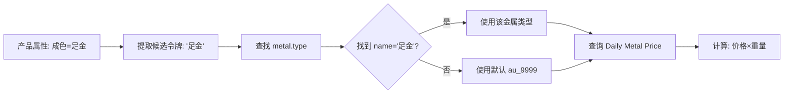

# ⚡ 快速修复："足金"产品价格显示问题

## 🔍 问题

产品 `0520000699` 在 POS 中显示：
- 当前显示：`1.00x￥880/g`
- 期望显示：`￥512/g x 125 g = ￥64,000.00`

## 💡 根本原因

产品属性值是"**足金**"，但系统中**没有名为"足金"的金属类型**！

代码逻辑：
```
产品属性"足金" → 查找 metal.type 的 name='足金' → 找不到 → 使用默认值
```

## ✅ 解决方案（2分钟搞定）

### 步骤 1: 创建"足金"金属类型 ⭐

1. 打开 Odoo
2. 进入 **POS → Metal Pricing → Metal Types**
3. 点击 **创建** 按钮
4. 填写：
   ```
   Name:                  足金
   Code:                  zu_jin
   Default Fineness Factor: 1.0
   Sequence:              11
   Description:           足金，与 Au 999.9 等价
   ```
5. 点击 **保存**

### 步骤 2: 创建"足金"的每日金价

1. 进入 **POS → Metal Pricing → Daily Metal Prices**
2. 点击 **创建** 按钮
3. 填写：
   ```
   Name:            足金-2024-10-09
   Company:         [选择您的公司]
   Metal Type:      足金 (zu_jin)  ← 选择刚创建的
   Price (CNY/gram): 512.000
   Fineness Factor: 1.0  (自动填充)
   Effective Date:  2024-10-09  (今天)
   Active:          ✓ 勾选
   ```
4. 点击 **保存**

### 步骤 3: 重启服务并测试

```bash
# 重启 Odoo 服务
sudo systemctl restart odoo
# 或者
./odoo-bin -c odoo.conf
```

然后：
1. 清除浏览器缓存 (Ctrl+Shift+Del)
2. 重新打开 POS 会话
3. 扫描或选择产品 `0520000699`
4. ✅ 应该显示：`￥512/g x 125 g`，总价 `￥64,000.00`

---

## 🧪 快速验证（可选）

### 通过 Python Shell 测试

```bash
./odoo-bin shell -c odoo.conf -d your_database
```

```python
# 1. 检查"足金"金属类型是否存在
metal_type = env['metal.type'].search([('name', '=', '足金')])
print(f"找到金属类型: {metal_type.name} (ID: {metal_type.id})")

# 2. 检查今天的金价
from datetime import date
pricelist = env['metal.pricelist'].search([
    ('metal_type_id', '=', metal_type.id),
    ('effective_date', '<=', str(date.today()))
], order='effective_date desc', limit=1)
print(f"找到金价: {pricelist.name}, 价格: ￥{pricelist.price_per_g}/g")

# 3. 测试产品价格计算
product = env['product.product'].search([('barcode', '=', '0520000699')], limit=1)
if product:
    price_data = product.pos_compute_price_by_weight()
    print(f"\n产品: {product.name}")
    print(f"  重量: {price_data.get('weight_g')} g")
    print(f"  单价: ￥{price_data.get('price_per_g')}/g")
    print(f"  总价: ￥{price_data.get('price_per_g', 0) * price_data.get('weight_g', 0):,.2f}")
else:
    print("产品未找到")
```

预期输出：
```
找到金属类型: 足金 (ID: 5)
找到金价: 足金-2024-10-09, 价格: ￥512.0/g
产品: [您的产品名称]
  重量: 125.0 g
  单价: ￥512.0/g
  总价: ￥64,000.00
```

---

## 📋 检查清单

- [ ] 在 **Metal Types** 中创建了"足金"
- [ ] 在 **Daily Metal Prices** 中为"足金"添加了价格（512元/克）
- [ ] 价格记录的 **Effective Date** 是今天或更早
- [ ] 价格记录的 **Active** 已勾选
- [ ] 已重启 Odoo 服务
- [ ] 已清除浏览器缓存
- [ ] 在 POS 中测试，显示正确

---

## 🎯 为什么要这样做？

系统的工作流程：



**关键点**: 产品属性值"足金"必须能在 `metal.type` 表中找到匹配的记录（name 或 code）。

---

## 🆘 还是不行？

### 检查产品属性是否正确

```python
product = env['product.product'].search([('barcode', '=', '0520000699')], limit=1)
for ptav in product.product_template_attribute_value_ids:
    print(f"属性: {ptav.attribute_id.name} = {ptav.name}")
```

确认输出包含：`成色 = 足金` 或类似内容。

### 检查属性名称是否完全匹配

- ✅ 正确：`足金`
- ❌ 错误：`足 金`（有空格）
- ❌ 错误：`足金999`（多余字符）

属性值必须**精确匹配** metal.type 的 name 或 code。

### 使用调试模式

```python
product = env['product.product'].search([('barcode', '=', '0520000699')], limit=1)
tokens = product._pos_weight_pricing_candidate_tokens()
print(f"提取的候选令牌: {tokens}")
# 应该输出: ['足金'] 或包含'足金'
```

如果输出不包含"足金"，说明产品属性配置有问题。

---

## 📞 需要帮助？

参考完整文档：
- [SETUP_ZU_JIN.md](SETUP_ZU_JIN.md) - 详细设置指南
- [UPGRADE.md](UPGRADE.md) - 升级和迁移
- [README.md](README.md) - 模块说明

